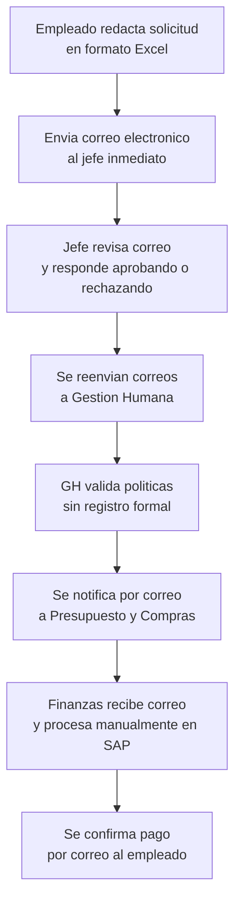
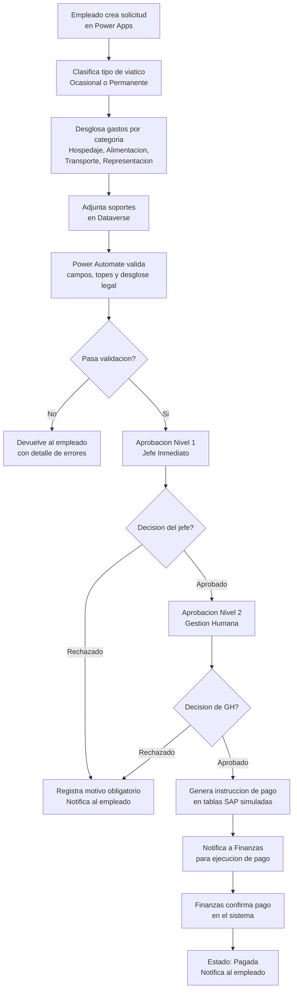

# Propuesta de Solucion - Sistema de Gestion de Viaticos

## 1. Flujo AS-IS (Estado Actual)

El proceso actual de viaticos opera de forma manual y fragmentada entre multiples areas:

### Problemas identificados

| Problema | Impacto |
|----------|---------|
| Solicitudes por correo y Excel | No hay trazabilidad de estados, demoras ni responsables |
| Aprobaciones por correo | Sin registro de auditoria, sin SLAs, sin control de quien aprobo y cuando |
| Documentacion manual | Errores frecuentes en resoluciones, formatos de anticipo y clausulas de confidencialidad |
| Legalizacion en formatos dispersos | Excel, fotos, escaneos con inconsistencias que retrasan cierres contables |
| Notificacion de pago por correo | Conciliacion manual entre lo aprobado y lo efectivamente girado |
| Sin clasificacion legal | No se discriminan categorias de gasto, riesgo de tratamiento salarial incorrecto (Art. 130 CST) |

---

## 2. Flujo TO-BE (Solucion Propuesta)

La solucion digitaliza el proceso completo con orquestacion en Power Automate y datos centralizados en Dataverse:

### Mejoras logradas

| Aspecto | AS-IS | TO-BE |
|---------|-------|-------|
| Solicitud | Correo + Excel | Formulario Power Apps con validaciones |
| Clasificacion legal | Inexistente | Obligatoria (Art. 130 CST) |
| Aprobaciones | Por correo, sin registro | Power Automate con auditoria automatica |
| Trazabilidad | Nula | Completa en tabla de auditoria |
| Notificaciones | Manuales por correo | Automaticas en cada hito |
| Pago | Proceso manual en SAP | Instruccion automatica via tablas OData |
| Conciliacion | Manual, propenso a errores | Cruce automatizado de anticipos y tarjetas |
| Seguridad | Sin control de acceso | RBAC por rol con Azure AD |
