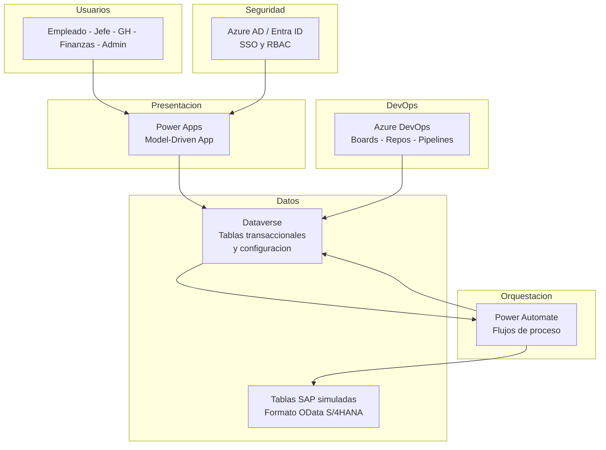
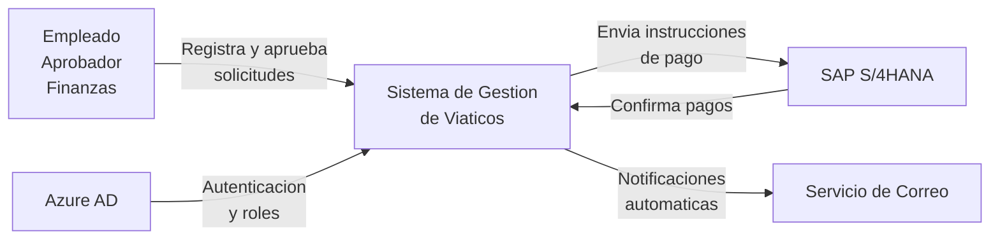
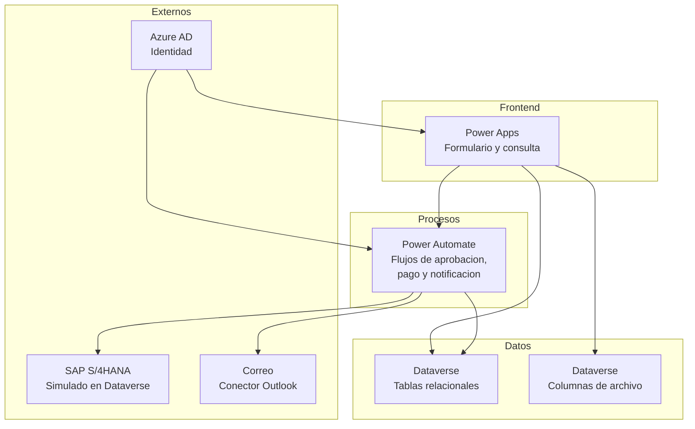
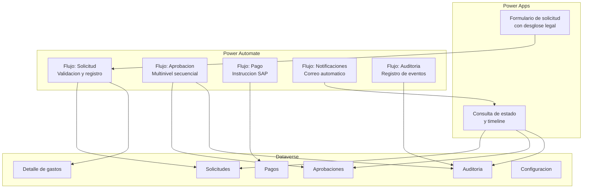
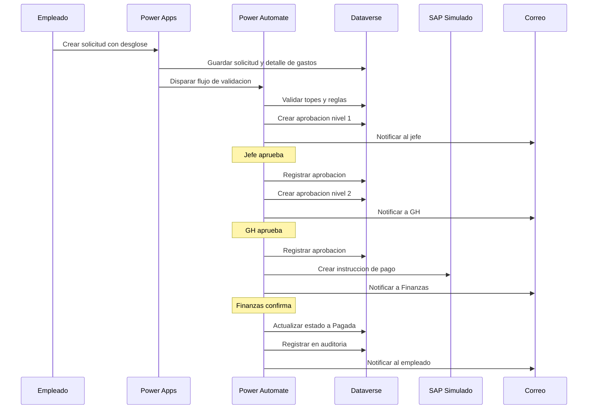
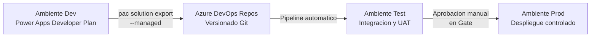

# Arquitectura del Sistema - Viaticos

## 1. Vista General



---

## 2. Contexto del Sistema (C1)

Vista de alto nivel que muestra el sistema y sus interacciones externas.



---

## 3. Contenedores (C2)



---

## 4. Componentes Internos (C3)



---

## 5. Flujo de Secuencia (C4)



---

## 6. Principios Arquitectonicos

| Principio | Aplicacion |
|-----------|-----------|
| Bajo acoplamiento | Cada flujo de Power Automate es independiente, activado por cambio de estado en Dataverse |
| Idempotencia | Toda operacion SAP incluye ID de transaccion unico para evitar duplicados |
| Auditoria desde el dia 1 | Cada cambio de estado genera registro automatico en tabla Auditoria |
| Diseno para migracion | Tablas SAP simuladas usan el mismo esquema OData que S/4HANA para migracion sin friccion |
| Configuracion sobre codigo | Reglas de monto, niveles de aprobacion, categorias y plantillas son tablas de configuracion, no codigo fijo |
| Separacion de ambientes | Dev/Test/Prod gestionados con soluciones managed via Azure DevOps Pipelines |

---

## 7. Matriz RBAC (Control de Acceso por Rol)

| Accion | Empleado | Jefe | GH | Finanzas | Admin |
|--------|----------|------|----|----------|-------|
| Crear solicitud | Solo propias | No | No | No | Todas |
| Leer solicitudes | Solo propias | Su equipo | Todas | Aprobadas | Todas |
| Editar solicitud | Solo en Borrador | No | No | No | Todas |
| Aprobar | No | Nivel 1 | Nivel 2 | No | Todas |
| Gestionar pagos | No | No | No | Si | Todas |
| Ver auditoria | Solo propias | Su equipo | Todas | Todas | Todas |
| Adjuntar documentos | Solo propias | No | No | No | Todas |
| Configuracion | No | No | No | No | Si |

### Grupos de seguridad en Azure AD

| Grupo | Rol Dataverse | Usuarios |
|-------|--------------|----------|
| Viaticos-Empleados | Empleado | Todos los empleados que solicitan viaticos |
| Viaticos-Jefes | Jefe | Jefes inmediatos con personal a cargo |
| Viaticos-GH | GH | Personal de Gestion Humana autorizado |
| Viaticos-Finanzas | Finanzas | Personal de pagos y tesoreria |
| Viaticos-Admin | Admin | Administradores funcionales del sistema |

---

## 8. Azure DevOps -- Estructura y Pipeline

### Estructura del proyecto

```
Proyecto: Viaticos-BanRep
|
|-- Boards/
|   |-- Epics (8 EPICs)
|   |-- User Stories (18 HUs)
|   |-- Tasks (desglose tecnico)
|   |-- Sprints (S1, S2, S3 + Estabilizacion)
|
|-- Repos/
|   |-- /solucion/           Soluciones Dataverse exportadas (.zip managed)
|   |-- /docs/               Documentacion del proyecto
|   |-- /pruebas/            Casos de prueba y evidencias
|   |-- /despliegue/         Configuracion de pipelines
|
|-- Pipelines/
    |-- export-solution      pac solution export --managed
    |-- import-to-test       pac solution import a Test
    |-- run-tests            Validaciones post-import
    |-- import-to-prod       Import a Prod con aprobacion manual
```

### Pipeline CI/CD



---

## 9. Flujos de Power Automate (Detalle)

### Flujo 1: Creacion y validacion de solicitud

| Aspecto | Detalle |
|---------|--------|
| Trigger | Registro nuevo en SOLICITUDES con estado = Enviada |
| Validaciones | Campos obligatorios, desglose de gastos completo, tipo de viatico seleccionado, monto vs topes, fechas coherentes |
| Acciones | Registrar auditoria, enviar correo de confirmacion, crear aprobacion nivel 1 con aprobador = jefe inmediato |

### Flujo 2: Aprobacion multinivel secuencial

| Aspecto | Detalle |
|---------|--------|
| Trigger | Cambio de estado en Aprobaciones |
| Si aprobado | Verificar si hay nivel N+1 en CONFIG_NIVELES_APROBACION. Si existe, crear siguiente aprobacion y notificar. Si no, marcar como Aprobada_GH y disparar Flujo 3 |
| Si rechazado | Validar comentario obligatorio. Marcar solicitud como Rechazada. Registrar auditoria. Notificar al solicitante |

### Flujo 3: Instruccion de pago (integracion SAP)

| Aspecto | Detalle |
|---------|--------|
| Trigger | Solicitud.estado = Aprobada_GH |
| Acciones | Generar id_transaccion unico. Buscar numero de empleado SAP por email. Construir payload OData. Escribir en SAP_INSTRUCCION_PAGO. Actualizar estado a En_Pago. Crear registro en PAGOS. Notificar a Finanzas |

### Flujo 4: Confirmacion de pago

| Aspecto | Detalle |
|---------|--------|
| Trigger | Actualizacion en SAP_CONFIRMACION_PAGO o actualizacion manual por Finanzas |
| Acciones | Buscar solicitud por id_transaccion. Actualizar PAGOS y SOLICITUD.estado = Pagada. Registrar auditoria. Notificar al empleado |

### Flujo 5: Auditoria automatica

| Aspecto | Detalle |
|---------|--------|
| Trigger | Cualquier cambio de estado en SOLICITUDES, APROBACIONES o PAGOS |
| Acciones | Registrar solicitud_id, usuario, accion, timestamp y detalle del cambio |

---

## 10. Evolucion Futura

| Componente | Proposito | Fase |
|-----------|----------|------|
| SAP S/4HANA real | Reemplazo de tablas simuladas por endpoints OData reales | Post-MVP |
| Power BI | Dashboard ejecutivo con metricas de solicitudes, tiempos y costos | Semana 8 |
| AI Builder (OCR) | Extraccion automatica de datos de facturas y recibos | Semana 8 |
| Azure Functions | Logica de negocio compleja que exceda capacidades de Power Automate | Post-MVP |
| Azure Monitor | Observabilidad centralizada de flujos, errores e integraciones | Post-MVP |
| SharePoint | Gestion documental avanzada cuando se cuente con licencia M365 | Post-MVP |
