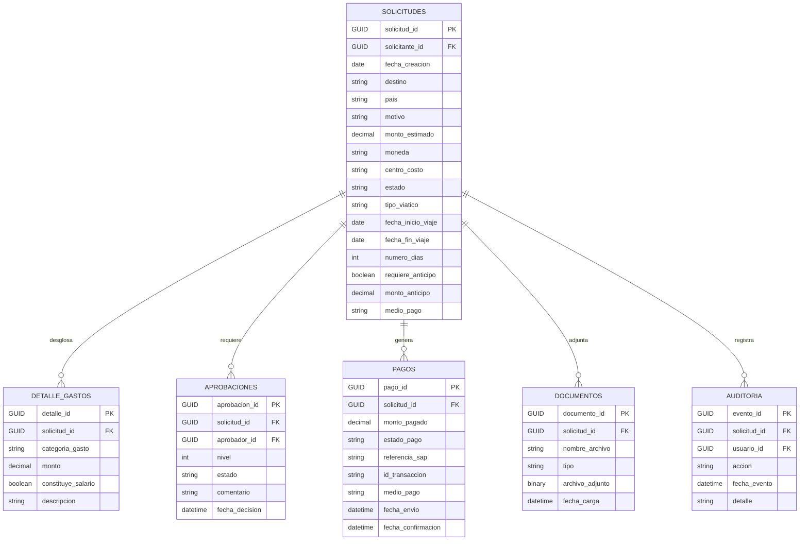
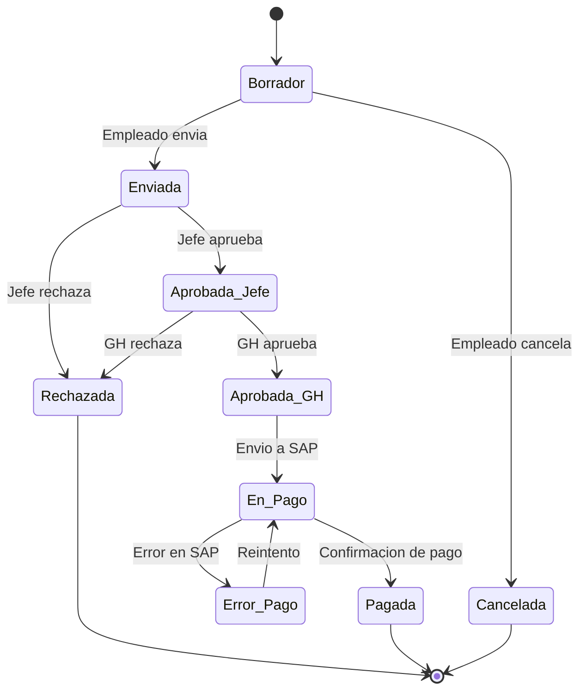

# Modelo de Datos - Sistema de Viaticos

## 1. Diagrama Entidad-Relacion

---

## 2. Descripcion de Entidades Transaccionales

### SOLICITUDES

Registro principal de cada solicitud de viaticos.

| Campo | Tipo | Requerido | Descripcion |
|-------|------|----------|-------------|
| solicitud_id | GUID | Si | Identificador unico (auto-generado) |
| solicitante_id | GUID (FK) | Si | Referencia al usuario que crea la solicitud |
| fecha_creacion | Date | Si | Fecha de creacion del registro |
| destino | String | Si | Ciudad o lugar de destino del viaje |
| pais | String | Si | Pais de destino |
| motivo | String | Si | Justificacion del viaje |
| monto_estimado | Decimal | Si | Monto total estimado del viaje |
| moneda | Option Set | Si | COP, USD, EUR |
| centro_costo | String | Si | Centro de costo que asume el gasto |
| estado | Option Set | Si | Ver catalogo de estados en seccion 4 |
| tipo_viatico | Option Set | Si | Ocasional o Permanente (Art. 130 CST) |
| fecha_inicio_viaje | Date | Si | Fecha de inicio del viaje |
| fecha_fin_viaje | Date | Si | Fecha de fin del viaje |
| numero_dias | Integer | Calculado | Diferencia entre fecha fin e inicio |
| requiere_anticipo | Boolean | Si | Indica si el empleado solicita anticipo |
| monto_anticipo | Decimal | Condicional | Monto del anticipo (si aplica) |
| medio_pago | Option Set | Si | Anticipo en efectivo, Tarjeta corporativa, Mixto |

### DETALLE_GASTOS

Desglose obligatorio de gastos por categoria, requerido por Art. 130 CST.

| Campo | Tipo | Requerido | Descripcion |
|-------|------|----------|-------------|
| detalle_id | GUID | Si | Identificador unico |
| solicitud_id | GUID (FK) | Si | Referencia a la solicitud |
| categoria_gasto | Option Set | Si | Hospedaje, Alimentacion, Transporte, Representacion, Otro |
| monto | Decimal | Si | Monto estimado para esta categoria |
| constituye_salario | Boolean | Calculado | Se calcula automaticamente segun tipo_viatico y categoria_gasto |
| descripcion | String | No | Detalle adicional del gasto |

### APROBACIONES

Registro de cada decision de aprobacion o rechazo por nivel.

| Campo | Tipo | Requerido | Descripcion |
|-------|------|----------|-------------|
| aprobacion_id | GUID | Si | Identificador unico |
| solicitud_id | GUID (FK) | Si | Referencia a la solicitud |
| aprobador_id | GUID (FK) | Si | Referencia al usuario aprobador |
| nivel | Integer | Si | 1 = Jefe Inmediato, 2 = Gestion Humana |
| estado | Option Set | Si | Pendiente, Aprobada, Rechazada |
| comentario | String | Condicional | Obligatorio en caso de rechazo |
| fecha_decision | DateTime | Si | Timestamp de la decision |

### PAGOS

Registro de instrucciones de pago y su confirmacion.

| Campo | Tipo | Requerido | Descripcion |
|-------|------|----------|-------------|
| pago_id | GUID | Si | Identificador unico |
| solicitud_id | GUID (FK) | Si | Referencia a la solicitud |
| monto_pagado | Decimal | Si | Monto efectivamente pagado |
| estado_pago | Option Set | Si | Pendiente, Enviado_SAP, Confirmado, Error |
| referencia_sap | String | Condicional | Referencia del documento contable en SAP |
| id_transaccion | String | Si | Identificador unico para idempotencia |
| medio_pago | Option Set | Si | Anticipo, Tarjeta_Corporativa, Transferencia |
| fecha_envio | DateTime | Si | Fecha de envio de la instruccion |
| fecha_confirmacion | DateTime | Condicional | Fecha de confirmacion del pago |

### DOCUMENTOS

Archivos adjuntos vinculados a cada solicitud.

| Campo | Tipo | Requerido | Descripcion |
|-------|------|----------|-------------|
| documento_id | GUID | Si | Identificador unico |
| solicitud_id | GUID (FK) | Si | Referencia a la solicitud |
| nombre_archivo | String | Si | Nombre del archivo adjunto |
| tipo | Option Set | Si | Invitacion, Anticipo, Factura, Resolucion, Confidencialidad, Otro |
| archivo_adjunto | File | Si | Archivo almacenado en columna de archivo de Dataverse |
| fecha_carga | DateTime | Si | Fecha de carga del archivo |

### AUDITORIA

Registro inmutable de todos los eventos del sistema.

| Campo | Tipo | Requerido | Descripcion |
|-------|------|----------|-------------|
| evento_id | GUID | Si | Identificador unico |
| solicitud_id | GUID (FK) | Si | Referencia a la solicitud |
| usuario_id | GUID (FK) | Si | Usuario que ejecuto la accion |
| accion | String | Si | Creacion, Edicion, Aprobacion, Rechazo, Envio_SAP, Pago_Confirmado, etc. |
| fecha_evento | DateTime | Si | Timestamp del evento |
| detalle | String | Si | Descripcion del cambio realizado |

---

## 3. Entidades de Configuracion

| Tabla | Proposito | Campos clave |
|-------|----------|-------------|
| CONFIG_TOPES_MONTO | Topes maximos por destino, categoria y moneda | destino_tipo, categoria_gasto, moneda, monto_maximo, activo |
| CONFIG_NIVELES_APROBACION | Niveles de aprobacion configurables | nivel, rol_aprobador, descripcion, activo |
| CONFIG_CATEGORIAS_GASTO | Catalogo de categorias con regla salarial | nombre, constituye_salario_permanente, descripcion |
| CONFIG_ESTADOS_TRANSICION | Transiciones de estado permitidas | estado_origen, estado_destino, rol_ejecutor |
| CONFIG_TIPOS_DOCUMENTO | Tipos de documento y validaciones | nombre, extensiones_permitidas, tamano_maximo |

---

## 4. Tablas SAP Simuladas (Formato OData / S/4HANA)

Estas tablas replican el esquema de datos que usa SAP S/4HANA para instrucciones y confirmaciones de pago. Estan disenadas para que al momento de la integracion real, solo se reemplace el destino de escritura (de Dataverse a SAP OData endpoint) sin cambiar la logica de los flujos de Power Automate.

| Tabla simulada | Equivalente SAP | Campos |
|---------------|-----------------|--------|
| SAP_INSTRUCCION_PAGO | BKPF/BSEG | sociedad, centro_costo, numero_empleado_sap, monto, moneda, concepto, fecha_valor, id_transaccion, medio_pago |
| SAP_CONFIRMACION_PAGO | REGUP | referencia_pago, estado, fecha_ejecucion, banco, cuenta, monto_ejecutado |
| SAP_MAESTRO_EMPLEADOS | PA0001/PA0002 | numero_empleado (PERNR), nombre, centro_costo, sociedad, cuenta_bancaria, email_corporativo |
| SAP_CENTROS_COSTO | CSKS | centro_costo, descripcion, responsable, sociedad, activo |

### Mapeo Azure AD a SAP

| Campo Azure AD | Campo SAP | Mecanismo |
|---------------|-----------|----------|
| UserPrincipalName | PA0105 subtipo 0010 | Busqueda por email en SAP_MAESTRO_EMPLEADOS |
| EmployeeId (Entra ID) | PERNR | Mapeo directo |
| DisplayName | PA0002 | Verificacion cruzada |

---

## 5. Catalogo de Estados de Solicitud

### Tabla de transiciones

| Estado origen | Estado destino | Ejecutado por | Condicion |
|--------------|---------------|---------------|----------|
| Borrador | Enviada | Empleado | Campos obligatorios completos, desglose de gastos presente |
| Borrador | Cancelada | Empleado | Sin restricciones |
| Enviada | Aprobada_Jefe | Jefe | Aprobacion nivel 1 |
| Enviada | Rechazada | Jefe | Comentario obligatorio |
| Aprobada_Jefe | Aprobada_GH | GH | Aprobacion nivel 2 |
| Aprobada_Jefe | Rechazada | GH | Comentario obligatorio |
| Aprobada_GH | En_Pago | Sistema | Instruccion de pago generada |
| En_Pago | Pagada | Sistema/Finanzas | Confirmacion de SAP o manual |
| En_Pago | Error_Pago | Sistema | Error en integracion SAP |
| Error_Pago | En_Pago | Sistema/Admin | Reintento de envio |

---

## 6. Topes de Monto Iniciales (Configurables)

| Destino | Hospedaje/noche | Alimentacion/dia | Transporte/dia | Representacion/dia |
|---------|----------------|------------------|----------------|-------------------|
| Nacional - ciudad principal | $250.000 COP | $120.000 COP | $80.000 COP | $100.000 COP |
| Nacional - ciudad intermedia | $180.000 COP | $90.000 COP | $60.000 COP | $70.000 COP |
| Internacional - Norteamerica | $200 USD | $80 USD | $60 USD | $100 USD |
| Internacional - Europa | $180 USD | $70 USD | $50 USD | $80 USD |
| Internacional - Latam | $120 USD | $50 USD | $40 USD | $60 USD |

Estos valores son editables por el rol Administrador en la tabla CONFIG_TOPES_MONTO.
