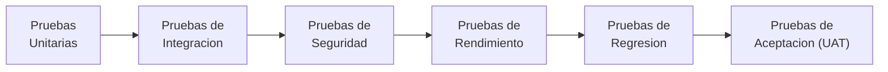
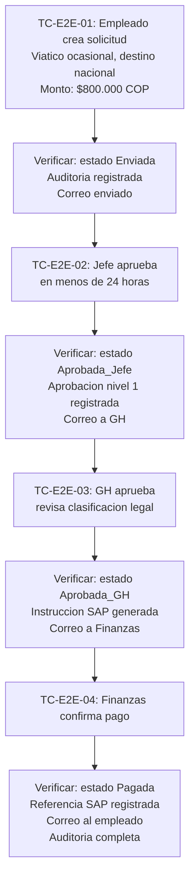

# Plan de Pruebas - MVP Sistema de Viaticos

## 1. Alcance

Este plan cubre las pruebas necesarias para validar la calidad del MVP antes de su despliegue en produccion. Aplica a todos los componentes: Power Apps, Power Automate, Dataverse, integracion SAP simulada y seguridad RBAC.

---

## 2. Estrategia de Pruebas

| Tipo | Objetivo | Responsable | Ambiente | Semana |
|------|----------|-------------|----------|--------|
| Unitarias | Verificar cada componente aislado | Desarrollador | Dev | S3-S4 |
| Integracion | Validar flujo E2E completo | Desarrollador + QA | Test | S4-S5 |
| Seguridad | Verificar RBAC y acceso por rol | QA + TI | Test | S5 |
| Rendimiento | Validar tiempos de respuesta bajo carga | QA | Test | S5 |
| Regresion | Re-ejecutar suite tras correcciones | QA | Test | S5 |
| Aceptacion (UAT) | Validacion con usuarios reales | Usuarios negocio | Test | S5 |

---

## 3. Criterios de Entrada y Salida

### Entrada (para iniciar pruebas)

- MVP funcional desplegado en ambiente Test
- Datos de prueba cargados (empleados, centros de costo, topes)
- Usuarios de prueba creados por cada rol (Empleado, Jefe, GH, Finanzas, Admin)
- Casos de prueba documentados y revisados

### Salida (para aprobar despliegue)

- 100% de casos criticos ejecutados y aprobados
- Cero defectos de severidad critica o alta sin resolver
- Cobertura de pruebas funcionales mayor o igual a 95%
- UAT firmada por representantes de GH y Finanzas
- Evidencias de prueba archivadas en `/pruebas/evidencias/`

---

## 4. Casos de Prueba Funcionales

### 4.1 Modulo Solicitudes

| ID | Caso | Precondicion | Pasos | Resultado esperado | Severidad |
|----|------|-------------|-------|-------------------|-----------|
| TC-SOL-01 | Crear solicitud valida | Usuario autenticado como Empleado | Llenar formulario con todos los campos, seleccionar tipo viatico, desglosar gastos, enviar | Solicitud creada con estado Enviada. Correo de confirmacion recibido | Critica |
| TC-SOL-02 | Crear solicitud sin tipo de viatico | Usuario autenticado como Empleado | Llenar formulario sin seleccionar tipo de viatico, intentar enviar | Error de validacion: tipo de viatico es obligatorio | Critica |
| TC-SOL-03 | Crear solicitud sin desglose de gastos | Usuario autenticado como Empleado | Llenar formulario sin agregar desglose por categoria, intentar enviar | Error de validacion: desglose de gastos obligatorio | Critica |
| TC-SOL-04 | Crear solicitud con monto superior al tope | Topes configurados en CONFIG_TOPES_MONTO | Crear solicitud con monto que excede el tope | Error: monto excede el tope permitido para el destino | Alta |
| TC-SOL-05 | Guardar solicitud como borrador | Usuario autenticado como Empleado | Llenar parcialmente y guardar como borrador | Solicitud guardada con estado Borrador, sin disparar flujos | Alta |
| TC-SOL-06 | Adjuntar documento PDF | Solicitud en estado Borrador | Cargar archivo PDF de 5 MB | Archivo almacenado y vinculado a la solicitud | Alta |
| TC-SOL-07 | Adjuntar archivo con formato no permitido | Solicitud en estado Borrador | Intentar cargar archivo .exe | Error: formato de archivo no permitido | Media |
| TC-SOL-08 | Cancelar solicitud en borrador | Solicitud en estado Borrador | Seleccionar cancelar solicitud | Estado cambia a Cancelada, auditoria registrada | Media |
| TC-SOL-09 | Fecha inicio mayor a fecha fin | Usuario crea solicitud | Ingresar fecha inicio posterior a fecha fin | Error de validacion | Alta |
| TC-SOL-10 | Seleccionar medio de pago | Usuario crea solicitud | Seleccionar tarjeta corporativa como medio de pago | Campo medio_pago registrado correctamente | Alta |

### 4.2 Modulo Aprobaciones

| ID | Caso | Precondicion | Pasos | Resultado esperado | Severidad |
|----|------|-------------|-------|-------------------|-----------|
| TC-APR-01 | Jefe aprueba solicitud | Solicitud en estado Enviada, usuario como Jefe | Abrir solicitud pendiente, aprobar | Estado cambia a Aprobada_Jefe. Auditoria registrada. Correo a GH | Critica |
| TC-APR-02 | Jefe rechaza sin comentario | Solicitud en estado Enviada, usuario como Jefe | Intentar rechazar sin comentario | Error: comentario obligatorio para rechazo | Critica |
| TC-APR-03 | Jefe rechaza con comentario | Solicitud en estado Enviada, usuario como Jefe | Rechazar con comentario | Estado = Rechazada. Correo al solicitante con motivo | Critica |
| TC-APR-04 | GH aprueba despues de Jefe | Solicitud en estado Aprobada_Jefe, usuario como GH | Aprobar solicitud | Estado = Aprobada_GH. Se dispara integracion SAP | Critica |
| TC-APR-05 | GH intenta aprobar sin aprobacion del Jefe | Solicitud en estado Enviada, usuario como GH | Buscar solicitud en lista de pendientes | Solicitud no aparece en la cola de GH | Critica |
| TC-APR-06 | Empleado intenta aprobar | Solicitud en estado Enviada, usuario como Empleado | Intentar acceder a la funcion de aprobacion | Funcion no visible o acceso denegado | Critica |

### 4.3 Modulo Pagos e Integracion SAP

| ID | Caso | Precondicion | Pasos | Resultado esperado | Severidad |
|----|------|-------------|-------|-------------------|-----------|
| TC-PAG-01 | Instruccion de pago exitosa | Solicitud Aprobada_GH | Flujo automatico se ejecuta | Registro en SAP_INSTRUCCION_PAGO con id_transaccion. Estado = En_Pago | Critica |
| TC-PAG-02 | Confirmacion de pago | Registro en SAP_CONFIRMACION_PAGO | Actualizar estado del pago | PAGOS.estado = Confirmado. Solicitud.estado = Pagada. Correo al empleado | Critica |
| TC-PAG-03 | Empleado sin mapeo SAP | Empleado sin registro en SAP_MAESTRO_EMPLEADOS | Flujo intenta buscar PERNR | Error registrado. Notificacion al Admin | Alta |
| TC-PAG-04 | Idempotencia de pago | Solicitud ya con instruccion de pago | Reintentar envio | No se crea duplicado. Mismo id_transaccion | Critica |

### 4.4 Modulo Auditoria y Notificaciones

| ID | Caso | Precondicion | Pasos | Resultado esperado | Severidad |
|----|------|-------------|-------|-------------------|-----------|
| TC-AUD-01 | Registro de auditoria en creacion | Solicitud creada | Verificar tabla AUDITORIA | Registro con accion=Creacion, usuario, fecha | Alta |
| TC-AUD-02 | Timeline completo | Solicitud con multiples eventos | Consultar detalle de solicitud | Timeline muestra todos los eventos en orden cronologico | Alta |
| TC-NOT-01 | Correo al crear solicitud | Solicitud enviada | Verificar buzon del solicitante y del jefe | Correo recibido con numero de solicitud, destino y monto | Alta |
| TC-NOT-02 | Correo al aprobar | Aprobacion registrada | Verificar buzon del solicitante | Correo con estado actualizado | Alta |
| TC-NOT-03 | Correo al pagar | Pago confirmado | Verificar buzon del solicitante | Correo de confirmacion de pago | Alta |

### 4.5 Modulo Seguridad RBAC

| ID | Caso | Precondicion | Pasos | Resultado esperado | Severidad |
|----|------|-------------|-------|-------------------|-----------|
| TC-SEG-01 | Empleado solo ve sus solicitudes | Multiples solicitudes de distintos empleados | Iniciar sesion como Empleado | Solo ve solicitudes propias | Critica |
| TC-SEG-02 | Jefe ve solicitudes de su equipo | Solicitudes de distintos equipos | Iniciar sesion como Jefe | Solo ve solicitudes de su equipo directo | Critica |
| TC-SEG-03 | GH ve todas las solicitudes | Solicitudes de toda la organizacion | Iniciar sesion como GH | Ve todas las solicitudes | Alta |
| TC-SEG-04 | Finanzas solo ve aprobadas | Solicitudes en distintos estados | Iniciar sesion como Finanzas | Solo ve solicitudes aprobadas y en proceso de pago | Alta |
| TC-SEG-05 | Admin accede a configuracion | Tablas CONFIG_* | Iniciar sesion como Admin | Puede editar tablas de configuracion | Alta |
| TC-SEG-06 | Empleado no accede a configuracion | Tablas CONFIG_* | Iniciar sesion como Empleado | Tablas de configuracion no visibles | Critica |

---

## 5. Pruebas de Integracion E2E

### Escenario completo: solicitud exitosa

### Escenario completo: solicitud rechazada

1. Empleado crea solicitud de viatico permanente con hospedaje ($2.500.000 COP)
2. Verificar: alerta de incidencia salarial generada a GH
3. Jefe aprueba
4. GH rechaza con comentario: "Monto de hospedaje excede politica"
5. Verificar: estado Rechazada, correo al empleado con motivo, auditoria completa

---

## 6. Pruebas de Rendimiento

| Metrica | Objetivo | Metodo de medicion |
|---------|----------|-------------------|
| Tiempo de carga del formulario | Menor a 3 segundos | Cronometro manual en primera carga |
| Tiempo de ejecucion del flujo de aprobacion | Menor a 30 segundos | Monitor de ejecucion de Power Automate |
| Tiempo de escritura en SAP simulado | Menor a 5 segundos | Log de flujo |
| Consulta de Mis Solicitudes (50 registros) | Menor a 2 segundos | Cronometro con datos de prueba cargados |
| Carga de archivo (5 MB) | Menor a 10 segundos | Cronometro durante upload |

---

## 7. Reporte de Defectos

### Clasificacion de severidad

| Severidad | Descripcion | SLA de resolucion |
|-----------|------------|------------------|
| Critica | Bloquea funcionalidad core, sin workaround | 4 horas |
| Alta | Funcionalidad degradada con workaround posible | 8 horas |
| Media | Defecto menor, no impacta flujo principal | 24 horas |
| Baja | Cosmetico o mejora de UX | Siguiente sprint |

### Registro

Todos los defectos se registran como Work Items tipo Bug en Azure DevOps Boards con: descripcion, pasos para reproducir, resultado esperado vs actual, severidad, evidencia (captura de pantalla) y asignacion.

---

## 8. Entregables de Pruebas

| Entregable | Ubicacion | Responsable |
|-----------|-----------|-------------|
| Casos de prueba documentados | /pruebas/casos/ | QA |
| Evidencias de ejecucion | /pruebas/evidencias/ | QA |
| Reporte de defectos | Azure DevOps Boards | QA |
| Acta de UAT firmada | /pruebas/uat/ | QA + Negocio |
| Reporte final de calidad | /pruebas/ | QA |
