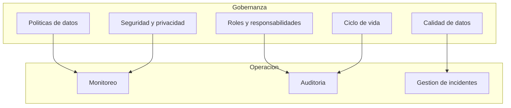

# Gobernanza de Datos - MVP Sistema de Viaticos

## 1. Objetivo

Establecer las politicas, roles, procesos y controles para garantizar la calidad, seguridad, integridad y trazabilidad de los datos gestionados por el sistema de viaticos, en cumplimiento con las politicas internas del Banco de la Republica y la normativa colombiana aplicable.

---

## 2. Marco de Gobernanza

---

## 3. Clasificacion de Datos

| Categoria | Nivel de sensibilidad | Datos incluidos | Controles requeridos |
|-----------|----------------------|-----------------|---------------------|
| Datos personales | Alto | Nombre, correo, numero de empleado, cuenta bancaria | Cifrado, acceso restringido, consentimiento, retencion limitada |
| Datos financieros | Alto | Montos, centros de costo, referencias SAP, pagos | Cifrado, auditoria, acceso restringido a Finanzas y Admin |
| Datos laborales | Medio | Tipo de viatico, clasificacion salarial, frecuencia de viajes | Acceso restringido a GH y Admin |
| Datos operativos | Medio | Estados de solicitud, fechas, destinos | Acceso segun rol RBAC |
| Datos de configuracion | Bajo | Topes de monto, niveles de aprobacion, categorias | Solo Admin puede modificar |
| Datos de auditoria | Alto | Registro de eventos, acciones, timestamps | Solo lectura, retencion extendida |

---

## 4. Roles de Gobernanza de Datos

| Rol | Responsabilidad | Asignacion supuesta |
|-----|----------------|-------------------|
| Data Owner | Define politicas de acceso y uso de datos del dominio de viaticos | Director de Gestion Humana |
| Data Steward | Implementa y monitorea la calidad de datos, resuelve problemas | Analista funcional designado |
| Data Custodian | Administra la infraestructura tecnica de datos (Dataverse, backups) | Equipo de TI |
| Oficial de proteccion de datos | Supervisa cumplimiento de normativa de datos personales | Area juridica / Compliance |
| Usuarios de datos | Consumen datos segun su rol y permisos | Empleados, Jefes, GH, Finanzas |

---

## 5. Politicas de Calidad de Datos

### 5.1 Reglas de validacion

| Dato | Regla | Implementacion |
|------|-------|---------------|
| Email corporativo | Formato valido, dominio del Banco | Validacion en Power Apps |
| Monto de solicitud | Mayor a cero, numerico, maximo 2 decimales | Regla de negocio en Dataverse |
| Tipo de viatico | Valor debe existir en catalogo (Ocasional/Permanente) | Option Set en Dataverse |
| Centro de costo | Debe existir en SAP_CENTROS_COSTO | Lookup en Power Apps |
| Desglose de gastos | Suma de categorias debe ser igual al monto total estimado | Validacion en flujo de Power Automate |
| Fechas | Fecha inicio menor o igual a fecha fin, ambas futuras | Regla de negocio en Dataverse |
| Numero de empleado SAP | Debe existir en SAP_MAESTRO_EMPLEADOS | Validacion en flujo antes de pago |

### 5.2 Indicadores de calidad

| Indicador | Meta | Medicion |
|-----------|------|---------|
| Completitud de datos | 100% de campos obligatorios llenos | Consulta Dataverse mensual |
| Precision de clasificacion legal | 100% con tipo de viatico correcto | Revision GH trimestral |
| Consistencia de desglose | 100% donde suma categorias = monto total | Validacion automatica |
| Datos duplicados | 0% de solicitudes duplicadas | Regla de deteccion automatica |
| Datos de maestro SAP actualizados | 100% de empleados activos con PERNR | Sincronizacion mensual |

---

## 6. Seguridad y Privacidad de Datos

### 6.1 Principios

| Principio | Aplicacion |
|-----------|-----------|
| Minimo privilegio | Cada rol solo accede a los datos que necesita (ver Matriz RBAC en 03_arquitectura.md) |
| Cifrado en transito | Todas las comunicaciones usan HTTPS/TLS (nativo de Power Platform) |
| Cifrado en reposo | Dataverse cifra datos en reposo con claves gestionadas por Microsoft |
| Anonimizacion | Datos personales en reportes agregados se anonimizan |
| Retencion definida | Los datos tienen periodo de retencion segun categoria |
| Consentimiento | Los empleados son informados del tratamiento de sus datos |

### 6.2 Normativa aplicable

| Normativa | Aplicacion |
|-----------|-----------|
| Ley 1581 de 2012 (Proteccion de datos personales) | Tratamiento de datos personales de empleados |
| Decreto 1377 de 2013 | Reglamentacion de autorizacion y politicas de tratamiento |
| Ley 1712 de 2014 (Transparencia) | Acceso a informacion publica del Banco |
| Politicas internas del Banco de la Republica | Gobierno de datos y DLP corporativo |

---

## 7. Ciclo de Vida de los Datos

| Etapa | Descripcion | Responsable |
|-------|------------|-------------|
| Creacion | Empleado registra solicitud en Power Apps | Empleado |
| Almacenamiento | Datos almacenados en Dataverse, documentos en columnas de archivo | Dataverse (automatico) |
| Uso | Consulta, aprobacion, pago, auditoria | Segun rol RBAC |
| Comparticion | Notificaciones por correo (sin datos sensibles en el cuerpo) | Power Automate |
| Archivo | Solicitudes completadas (Pagada/Rechazada/Cancelada) pasan a estado historico despues de 12 meses | Data Steward |
| Eliminacion | Datos anonimizados despues de 5 anos (o segun politica del Banco) | Data Custodian |

### Periodos de retencion (supuestos)

| Tipo de dato | Retencion activa | Retencion historica | Eliminacion |
|-------------|-----------------|--------------------|-----------| 
| Solicitudes y aprobaciones | 2 anos | 5 anos | Despues de 7 anos |
| Datos de pago y referencias SAP | 5 anos | 10 anos | Despues de 15 anos (norma contable) |
| Documentos adjuntos (facturas) | 5 anos | 5 anos | Despues de 10 anos (norma tributaria DIAN) |
| Auditoria | 5 anos | Indefinido | No se elimina |
| Datos de configuracion | Vigente | N/A | Al desactivar |

---

## 8. DLP (Prevencion de Perdida de Datos)

### Politicas en Power Platform

| Politica | Regla |
|----------|-------|
| Conectores de negocio | Dataverse, Office 365 Outlook, SAP OData clasificados como "Business" |
| Conectores bloqueados | Redes sociales, conectores personales, almacenamiento externo no autorizado |
| Conectores restringidos | SharePoint personal, OneDrive personal |
| Comparticion de apps | Solo dentro del tenant del Banco, no se permite compartir externamente |
| Exportacion de datos | Deshabilitada para roles Empleado y Jefe. Habilitada solo para Admin y GH |

---

## 9. Monitoreo y Auditoria de Datos

| Control | Frecuencia | Responsable |
|---------|-----------|-------------|
| Revision de permisos de acceso | Mensual | Data Custodian |
| Verificacion de calidad de datos | Mensual | Data Steward |
| Auditoria de accesos a datos sensibles | Trimestral | Oficial de proteccion de datos |
| Revision de politicas DLP | Semestral | TI + Data Owner |
| Backup y recuperacion (drill) | Trimestral | Data Custodian |
