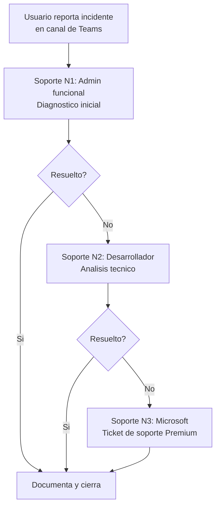

# SRE, Seguridad y Operaciones - MVP Sistema de Viaticos

## 1. Objetivo

Definir las practicas de confiabilidad, seguridad y operaciones que garantizan la disponibilidad, integridad y continuidad del sistema de viaticos en produccion.

---

## 2. Modelo de Responsabilidad Compartida

| Capa | Responsable | Alcance |
|------|------------|---------|
| Infraestructura cloud (compute, storage, red) | Microsoft (Power Platform / Azure) | SLA 99.9% de disponibilidad |
| Plataforma (Dataverse, Power Automate, Power Apps) | Microsoft | Actualizaciones, parches, escalabilidad automatica |
| Aplicacion (flujos, formularios, reglas, configuracion) | Equipo de desarrollo del Banco | Logica de negocio, calidad de datos, monitoreo de flujos |
| Datos (accuracy, clasificacion, retencion) | Equipo funcional del Banco | Calidad, gobernanza, cumplimiento normativo |
| Identidad y acceso | TI del Banco + Microsoft (Entra ID) | Grupos, roles, MFA, politicas de acceso condicional |

---

## 3. Objetivos de Nivel de Servicio (SLOs)

| Servicio | SLO | Metrica | Medicion |
|----------|-----|---------|---------|
| Disponibilidad de Power Apps | 99.5% en horario laboral (L-V, 7am-7pm) | Tiempo de respuesta del portal | Monitoreo manual + reporte Microsoft |
| Ejecucion de flujos de aprobacion | 99% de ejecuciones exitosas | Tasa de exito en historial de flujos | Centro de administracion de Power Automate |
| Tiempo de respuesta del formulario | Menor a 3 segundos | Tiempo de carga percibido | Medicion periodica manual |
| Disponibilidad de Dataverse | 99.9% (SLA de Microsoft) | Uptime de la instancia | Dashboard de Microsoft 365 Health |
| Notificaciones enviadas | 99% de correos entregados en menos de 5 minutos | Tasa de entrega vs eventos generados | Log de flujo de notificaciones |
| Instrucciones de pago SAP | 99% sin errores | Tasa de registros exitosos en SAP_INSTRUCCION_PAGO | Consulta de tabla de pagos |

---

## 4. Seguridad

### 4.1 Autenticacion y acceso

| Control | Implementacion |
|---------|---------------|
| Single Sign-On (SSO) | Azure AD / Entra ID nativo en Power Platform |
| Autenticacion multifactor (MFA) | Politica de acceso condicional de Azure AD |
| Acceso condicional | Solo desde red corporativa o dispositivos gestionados (si aplica politica del Banco) |
| Timeout de sesion | Configuracion de inactividad de sesion en Power Apps (30 minutos supuesto) |
| Bloqueo de cuenta | Politica de Azure AD: bloqueo tras 5 intentos fallidos |

### 4.2 Seguridad de datos

| Control | Implementacion |
|---------|---------------|
| Cifrado en transito | TLS 1.2+ (nativo de Power Platform) |
| Cifrado en reposo | AES-256, claves gestionadas por Microsoft |
| Segregacion de datos | Roles de seguridad de Dataverse con filtros por Business Unit |
| Prevencion de exfiltracion | Politicas DLP de Power Platform |
| Auditoria de acceso | Log nativo de Dataverse + tabla AUDITORIA del sistema |

### 4.3 Seguridad de la aplicacion

| Control | Implementacion |
|---------|---------------|
| Validacion de entrada | Reglas de negocio en Dataverse + validaciones en Power Apps |
| Inyeccion de datos | Dataverse sanitiza entradas automaticamente |
| Control de archivos | Validacion de tipo y tamano de archivo antes de aceptar |
| Flujos protegidos | Flujos de Power Automate no son editables por usuarios finales |
| Versionado de solucion | Solucion managed: no se puede modificar en destino |

---

## 5. Gestion de Incidentes

### 5.1 Clasificacion

| Prioridad | Descripcion | Tiempo de respuesta | Tiempo de resolucion |
|-----------|------------|--------------------|--------------------|
| P1 - Critica | Sistema no disponible o flujo de pago bloqueado | 15 minutos | 2 horas |
| P2 - Alta | Funcionalidad degradada (aprobaciones no llegan, notificaciones fallan) | 30 minutos | 4 horas |
| P3 - Media | Funcionalidad menor afectada (filtros no funcionan, UX degradada) | 2 horas | 8 horas |
| P4 - Baja | Solicitud de mejora o defecto cosmetico | 24 horas | Siguiente sprint |

### 5.2 Proceso de escalamiento

### 5.3 Canales de soporte

| Canal | Horario | Responsable |
|-------|---------|-------------|
| Canal de Teams: Viaticos-Soporte | L-V, 7am-6pm | Admin funcional |
| Correo: soporte-viaticos@banrep.gov.co (supuesto) | L-V, 7am-6pm | Equipo de soporte |
| Telefono de emergencia (P1) | 24/7 | Guardia TI |

---

## 6. Monitoreo y Alertas

### 6.1 Puntos de monitoreo

| Componente | Que monitorear | Herramienta | Frecuencia |
|-----------|---------------|-------------|-----------|
| Power Automate | Flujos fallidos, flujos en cola, tiempo de ejecucion | Centro de administracion Power Automate | Continuo |
| Dataverse | Capacidad de almacenamiento, registros creados | Power Platform Admin Center | Diario |
| Power Apps | Errores de aplicacion, sesiones activas | Application Insights (si se configura) | Continuo |
| Correo | Correos no entregados | Log del conector de Outlook | Diario |
| Pagos | Instrucciones en estado Error_Pago por mas de 1 hora | Consulta programada en Power Automate | Cada hora |
| Aprobaciones | Solicitudes pendientes por mas de 48 horas | Alerta de Power Automate | Cada 24 horas |

### 6.2 Alertas automatizadas

| Alerta | Condicion | Destinatario | Medio |
|--------|----------|-------------|-------|
| Flujo fallido | Cualquier flujo falla en ejecucion | Admin | Correo + Teams |
| Pago atascado | SAP_INSTRUCCION_PAGO con estado Enviado por mas de 2 horas | Admin + Finanzas | Correo |
| Aprobacion vencida | Aprobacion pendiente por mas de 48 horas | Aprobador + GH | Correo recordatorio |
| Capacidad al 80% | Almacenamiento de Dataverse al 80% del limite | Admin | Correo |
| Error de mapeo SAP | Empleado sin PERNR | Admin | Correo |

---

## 7. Continuidad y Recuperacion

### 7.1 Backups

| Elemento | Estrategia | RPO | RTO |
|----------|-----------|-----|-----|
| Dataverse | Backup automatico de Microsoft (cada 4 horas, retencion de 28 dias) | 4 horas | 4 horas |
| Solucion (Power Apps, Power Automate) | Exportacion managed en Azure DevOps Repos (versionada) | Ultimo commit | 1 hora (reimportar) |
| Configuracion (topes, niveles, categorias) | Incluida en backup de Dataverse + exportacion manual mensual | 4 horas | 1 hora |
| Documentos adjuntos | Incluidos en backup de Dataverse | 4 horas | 4 horas |

### 7.2 Plan de recuperacion ante desastre

| Escenario | Accion | Tiempo estimado |
|-----------|--------|----------------|
| Fallo de flujo critico | Reiniciar flujo manualmente o reimportar solucion desde Azure DevOps | 30 minutos |
| Corrupcion de datos de configuracion | Restaurar desde backup de Dataverse (ultimas 4 horas) | 2 horas |
| Indisponibilidad de Power Platform (regional) | Esperar recuperacion de Microsoft (SLA 99.9%). No hay failover multi-region en Developer Plan | Hasta 4 horas |
| Perdida de acceso Azure AD | Contactar TI para restaurar acceso. No impacta datos | 1 hora |

---

## 8. Gestion de Cambios

| Tipo de cambio | Proceso | Aprobacion |
|---------------|---------|-----------|
| Cambio de configuracion (topes, niveles) | Admin modifica tabla de configuracion. Se registra en auditoria | No requiere despliegue |
| Cambio menor de aplicacion (UI, validaciones) | Desarrollar en Dev, exportar, pipeline a Test, UAT, pipeline a Prod | Aprobacion en gate de Azure DevOps |
| Cambio mayor (nuevo flujo, nueva tabla) | Diseno, desarrollo, pruebas completas, UAT, despliegue | Aprobacion de Product Owner + TI |
| Hotfix de emergencia | Correccion directa en ambiente afectado, documentar post-mortem | Aprobacion verbal de Admin + TI |
