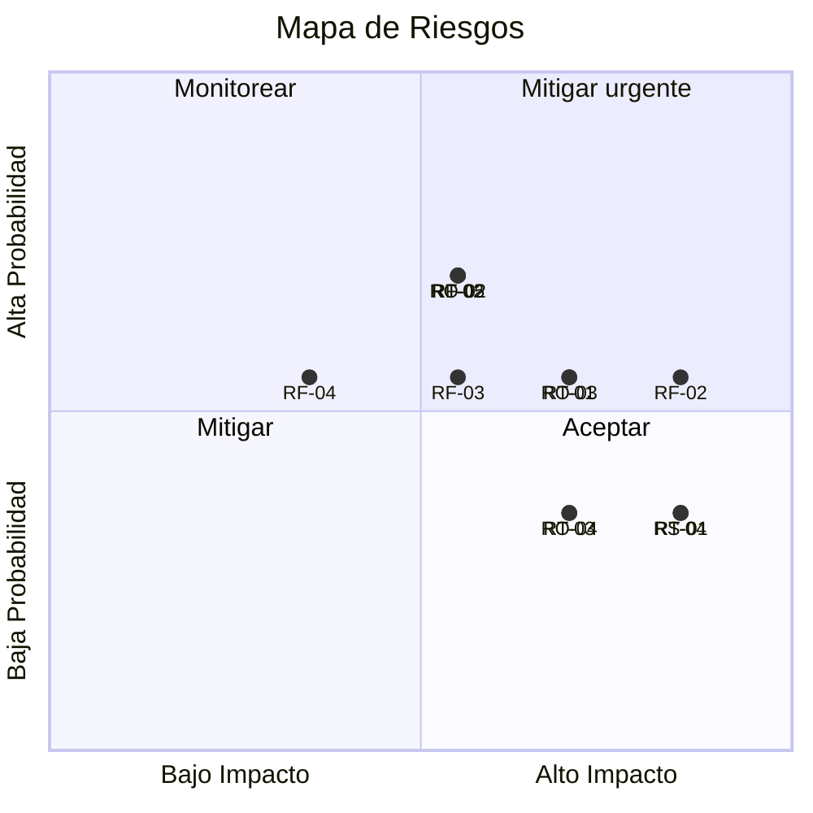

# Registro de Riesgos - MVP Sistema de Viaticos

## 1. Metodologia

Los riesgos se evaluan con una matriz de probabilidad e impacto en escala 1-5. El nivel de riesgo se calcula como Probabilidad x Impacto.

| Nivel | Rango | Accion requerida |
|-------|-------|-----------------|
| Critico | 15-25 | Mitigacion inmediata obligatoria. Escalamiento al sponsor |
| Alto | 10-14 | Plan de mitigacion definido y ejecutado antes de iniciar fase |
| Medio | 5-9 | Monitoreo activo con plan de contingencia preparado |
| Bajo | 1-4 | Aceptar y monitorear periodicamente |

---

## 2. Riesgos del Proyecto

### 2.1 Riesgos Tecnicos

| ID | Riesgo | Prob. | Imp. | Nivel | Mitigacion | Responsable |
|----|--------|-------|------|-------|-----------|-------------|
| RT-01 | Limites de capacidad del Developer Plan insuficientes para la demo con datos reales | 3 | 4 | 12 Alto | Monitorear capacidad desde semana 2. Tener presupuesto aprobado para upgrade si se requiere | Desarrollador |
| RT-02 | Integracion SAP real no disponible en el plazo del MVP por retrasos en equipo SAP Basis | 4 | 3 | 12 Alto | Tablas SAP simuladas en Dataverse permiten continuar sin dependencia. La integracion real se hace post-MVP | Arquitecto |
| RT-03 | Flujos de Power Automate alcanzan limites de ejecucion o throttling | 2 | 4 | 8 Medio | Disenar flujos con manejo de reintentos. Monitorear limites de API | Desarrollador |
| RT-04 | Ambiente de Dataverse eliminado por inactividad (politica de 90 dias) | 2 | 5 | 10 Alto | Acceder al ambiente al menos cada 60 dias. Tener solucion exportada en Azure DevOps | Desarrollador |
| RT-05 | Conectores de correo no funcionan con la infraestructura de Exchange del Banco | 3 | 3 | 9 Medio | Probar conector en semana 2. Tener alternativa SMTP generica | Desarrollador |
| RT-06 | Migracion a SAP S/4HANA cambia esquemas OData planificados | 3 | 4 | 12 Alto | Disenar capa de abstraccion. Las tablas simuladas se reemplazan sin cambiar logica de flujos | Arquitecto |

### 2.2 Riesgos Funcionales

| ID | Riesgo | Prob. | Imp. | Nivel | Mitigacion | Responsable |
|----|--------|-------|------|-------|-----------|-------------|
| RF-01 | Reglas de negocio de viaticos no completamente definidas antes de construir | 3 | 4 | 12 Alto | Congelar alcance y reglas en semana 1. Documentar supuestos. Todo configurable via tablas | Product Owner |
| RF-02 | Clasificacion legal de viaticos (Art. 130 CST) genera ambiguedad en casos de borde | 3 | 5 | 15 Critico | Validar criterios con area juridica del Banco en semana 1. Implementar como parametros editables por Admin | Product Owner + Legal |
| RF-03 | Usuarios finales resisten el cambio del proceso manual al digital | 3 | 3 | 9 Medio | Plan de capacitacion por rol. Champions por area. Restriccion progresiva del correo | Product Owner |
| RF-04 | Topes de monto iniciales no reflejan la realidad operativa | 3 | 2 | 6 Medio | Valores configurables por Admin. Ajustar con datos reales en primeras 2 semanas de operacion | GH |
| RF-05 | El flujo de aprobacion no cubre todos los escenarios reales (delegados, ausencias, vacaciones) | 4 | 3 | 12 Alto | MVP cubre solo el flujo base. Escenarios avanzados de delegacion se planifican para fase 2 | Arquitecto |

### 2.3 Riesgos Organizacionales

| ID | Riesgo | Prob. | Imp. | Nivel | Mitigacion | Responsable |
|----|--------|-------|------|-------|-----------|-------------|
| RO-01 | Falta de patrocinio ejecutivo que frene la adopcion | 2 | 5 | 10 Alto | Involucrar al Director de GH como sponsor activo desde semana 1 | Product Owner |
| RO-02 | Disponibilidad del equipo SAP limitada para definir contrato de integracion | 4 | 3 | 12 Alto | Usar tablas simuladas sin dependencia de SAP. Agendar sesiones con equipo SAP en semana 1 | Product Owner |
| RO-03 | Cambios de prioridad por la direccion que retrasen el proyecto | 3 | 4 | 12 Alto | Acta de compromiso con cronograma. Informes de avance semanales al sponsor | Project Manager |
| RO-04 | Rotacion de personal clave durante el proyecto | 2 | 4 | 8 Medio | Documentacion completa en /docs/. Transferencia de conocimiento continua | Project Manager |

### 2.4 Riesgos de Seguridad y Cumplimiento

| ID | Riesgo | Prob. | Imp. | Nivel | Mitigacion | Responsable |
|----|--------|-------|------|-------|-----------|-------------|
| RS-01 | Incumplimiento de Ley 1581 de proteccion de datos personales | 2 | 5 | 10 Alto | Implementar politicas de gobernanza de datos (ver 10_gobernanza_datos.md). Validar con oficial de proteccion de datos | Legal + TI |
| RS-02 | Acceso no autorizado a datos financieros o personales | 2 | 5 | 10 Alto | RBAC estricto con principio de minimo privilegio. Auditoria de accesos | TI |
| RS-03 | Datos de pago expuestos por mala configuracion de permisos | 2 | 5 | 10 Alto | Pruebas de seguridad por rol (TC-SEG-*). Revision de permisos mensual | QA + TI |

---

## 3. Mapa de Calor

---

## 4. Plan de Contingencia

| Escenario | Contingencia | Impacto en cronograma |
|-----------|-------------|---------------------|
| Developer Plan no cumple requisitos | Adquirir licencia Power Apps Trial (30 dias) o per-app ($5 USD/mes) | Ninguno si se actua en semana 2 |
| Reglas de negocio no congeladas | Iniciar construccion con supuestos documentados, ajustar en semana 5 | Potencial atraso de 1 semana |
| Equipo SAP no disponible | Continuar con tablas simuladas. Integracion real se posterga | Ninguno en MVP |
| Sponsor pierde interes | Presentar demo funcional en semana 4 para reactivar patrocinio | Riesgo de cancelacion |
| Incidente de seguridad en datos | Activar protocolo de incidentes del Banco. Suspender acceso hasta corregir | 1-2 dias |

---

## 5. Revision de Riesgos

| Actividad | Frecuencia | Responsable |
|----------|-----------|-------------|
| Revision del registro de riesgos | Semanal (en reunion de sprint) | Project Manager |
| Actualizacion de probabilidad e impacto | Al identificar nueva informacion | Project Manager |
| Escalamiento de riesgos criticos | Inmediato | Project Manager al sponsor |
| Post-mortem de riesgos materializados | Al cierre de cada sprint | Equipo completo |
