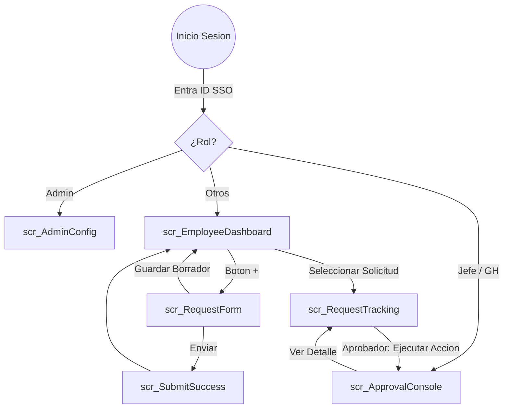

# Mapa de Navegación - Power Apps Viaticos

El siguiente diagrama detalla el flujo de pantallas y las condiciones de transición entre ellas.

## Resumen de Transiciones

1.  **Contexto de Solicitud**: Al pasar de la consola de aprobación al tracking, se pasa el ID de la solicitud como parámetro global.
2.  **Seguridad de Navegacion**: Las pantallas de administración y aprobación tienen reglas `OnVisible` que redirigen al Dashboard si el usuario no cuenta con el rol de seguridad adecuado en Dataverse.
3.  **Manejo de Errores**: Si ocurre un error de conexión, se muestra una barra de notificación superior (Azul con texto Oro) indicando al usuario que reintente.
